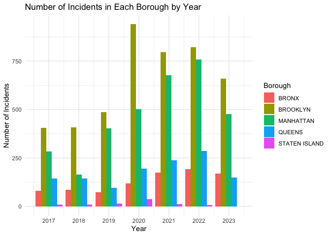

boro_nta
================
2024-12-03

load packages

``` r
library(ggplot2)
library(readxl)
library(readr)
library(tidyverse)
```

    ## ── Attaching core tidyverse packages ──────────────────────── tidyverse 2.0.0 ──
    ## ✔ dplyr     1.1.4     ✔ stringr   1.5.1
    ## ✔ forcats   1.0.0     ✔ tibble    3.2.1
    ## ✔ lubridate 1.9.3     ✔ tidyr     1.3.1
    ## ✔ purrr     1.0.2     
    ## ── Conflicts ────────────────────────────────────────── tidyverse_conflicts() ──
    ## ✖ dplyr::filter() masks stats::filter()
    ## ✖ dplyr::lag()    masks stats::lag()
    ## ℹ Use the conflicted package (<http://conflicted.r-lib.org/>) to force all conflicts to become errors

``` r
library(dplyr)
library(sf)
```

    ## Linking to GEOS 3.11.0, GDAL 3.5.3, PROJ 9.1.0; sf_use_s2() is TRUE

load dataset

``` r
df_descriptive=read_csv("filtered_merged_dataset_sample.csv")
```

    ## Rows: 10000 Columns: 20
    ## ── Column specification ────────────────────────────────────────────────────────
    ## Delimiter: ","
    ## chr   (8): BORO, PERP_AGE_GROUP, PERP_SEX, PERP_RACE, VIC_AGE_GROUP, VIC_SEX...
    ## dbl  (10): INCIDENT_KEY, PRECINCT, Latitude, Longitude, Number_poverty, Perc...
    ## date  (1): OCCUR_DATE
    ## time  (1): OCCUR_TIME
    ## 
    ## ℹ Use `spec()` to retrieve the full column specification for this data.
    ## ℹ Specify the column types or set `show_col_types = FALSE` to quiet this message.

``` r
data_final <- read_csv("data_final.csv")
```

    ## Rows: 9820 Columns: 39
    ## ── Column specification ────────────────────────────────────────────────────────
    ## Delimiter: ","
    ## chr  (16): BORO, LOC_OF_OCCUR_DESC, LOC_CLASSFCTN_DESC, LOCATION_DESC, PERP_...
    ## dbl  (15): INCIDENT_KEY, PRECINCT, JURISDICTION_CODE, X_COORD_CD, Y_COORD_CD...
    ## num   (2): Number_poverty, Number_education
    ## lgl   (3): STATISTICAL_MURDER_FLAG, Is_Holiday, Sky_Is_Dark
    ## dttm  (1): OCCUR_DATETIME
    ## date  (1): OCCUR_DATE
    ## time  (1): OCCUR_TIME
    ## 
    ## ℹ Use `spec()` to retrieve the full column specification for this data.
    ## ℹ Specify the column types or set `show_col_types = FALSE` to quiet this message.

Plot of the number of incidents in each borough for each year

``` r
# Summarize data: count the number of incidents by borough and year
incident_summary <- df_descriptive %>%
  group_by(BORO, Year) %>%
  summarise(Number_of_Incidents = n(), .groups = "drop") %>%
  # Ensure missing years and boroughs are included
  complete(BORO, Year = full_seq(min(df_descriptive$Year):max(df_descriptive$Year), 1), fill = list(Number_of_Incidents = 0))

# Create the bar plot
ggplot(incident_summary, aes(x = Year, y = Number_of_Incidents, fill = BORO)) +
  geom_bar(stat = "identity", position = "dodge") +
  labs(
    title = "Number of Incidents in Each Borough by Year",
    x = "Year",
    y = "Number of Incidents",
    fill = "Borough"
  ) +
  scale_x_continuous(breaks = seq(min(df_descriptive$Year), max(df_descriptive$Year), by = 1)) +
  theme_minimal()
```

<!-- -->

``` r
nta_summary <- df_descriptive %>%
  group_by(NTA_clean, BORO) %>%                 # Group by NTA and BORO
  summarise(Number_of_Incidents = n(), .groups = "drop") %>%  # Count incidents
  arrange(desc(Number_of_Incidents)) %>%  # Sort in descending order
  slice_head(n = 10)
nta_summary
```

    ## # A tibble: 10 × 3
    ##    NTA_clean          BORO      Number_of_Incidents
    ##    <chr>              <chr>                   <int>
    ##  1 east harlem        MANHATTAN                2690
    ##  2 bedford stuyvesant BROOKLYN                 1291
    ##  3 east new york      BROOKLYN                  734
    ##  4 brownsville        BROOKLYN                  651
    ##  5 bushwick           BROOKLYN                  612
    ##  6 jamaica            QUEENS                    442
    ##  7 sunset park        BROOKLYN                  385
    ##  8 flatbush           BROOKLYN                  197
    ##  9 washington heights MANHATTAN                 192
    ## 10 upper west side    MANHATTAN                 189

\##Total incidents per NTA

Load spatial data (replace with actual shapefile path)

``` r
nta_shape <- st_read("nynta2020_24d/nynta2020.shp")
```

    ## Reading layer `nynta2020' from data source 
    ##   `/Users/wangmingyin/Desktop/data science 1/nyc_shooting_final/nynta2020_24d/nynta2020.shp' 
    ##   using driver `ESRI Shapefile'
    ## Simple feature collection with 262 features and 11 fields
    ## Geometry type: MULTIPOLYGON
    ## Dimension:     XY
    ## Bounding box:  xmin: 913175.1 ymin: 120128.4 xmax: 1067383 ymax: 272844.3
    ## Projected CRS: NAD83 / New York Long Island (ftUS)

``` r
cdta_shape = st_read("nycdta2020_24d/nycdta2020.shp")
```

    ## Reading layer `nycdta2020' from data source 
    ##   `/Users/wangmingyin/Desktop/data science 1/nyc_shooting_final/nycdta2020_24d/nycdta2020.shp' 
    ##   using driver `ESRI Shapefile'
    ## Simple feature collection with 71 features and 8 fields
    ## Geometry type: MULTIPOLYGON
    ## Dimension:     XY
    ## Bounding box:  xmin: 913175.1 ymin: 120128.4 xmax: 1067383 ymax: 272844.3
    ## Projected CRS: NAD83 / New York Long Island (ftUS)

``` r
boro_shape = st_read("Borough Boundaries/geo_export_391a75ed-0ae4-4c88-8c30-3588c75bd01e.shp")
```

    ## Reading layer `geo_export_391a75ed-0ae4-4c88-8c30-3588c75bd01e' from data source `/Users/wangmingyin/Desktop/data science 1/nyc_shooting_final/Borough Boundaries/geo_export_391a75ed-0ae4-4c88-8c30-3588c75bd01e.shp' 
    ##   using driver `ESRI Shapefile'
    ## Simple feature collection with 5 features and 4 fields
    ## Geometry type: MULTIPOLYGON
    ## Dimension:     XY
    ## Bounding box:  xmin: -74.25559 ymin: 40.49613 xmax: -73.70001 ymax: 40.91553
    ## Geodetic CRS:  WGS84(DD)

``` r
# Prepare incident data: count incidents per NTA_clean
nta_incident_counts <- data_final %>%
  group_by(NTA) %>%
  summarise(Number_of_Incidents = n(), .groups = "drop")

# Merge spatial data with incident counts
nta_map_data <- nta_shape %>%
  left_join(nta_incident_counts, by = c("NTAName" = "NTA"))

# Create custom breaks for Number_of_Incidents
nta_map_data <- nta_map_data %>%
  mutate(
    Incident_Range = cut(
      Number_of_Incidents,
      breaks = seq(0, 400, by = 80),  # Breaks from 0 to 1000, every 200 cases
      labels = c("0-80", "81-160", "161-240", "241-320", "321-400"),
      include.lowest = TRUE
    )
  )
```

Plot the map

``` r
# Plot the map with custom ranges
ggplot(data = nta_map_data) +
  geom_sf(aes(fill = Incident_Range), color = "white", size = 0.2) +
  scale_fill_manual(
    values = c(
      "0-80" = "#b2e2e2",
      "81-160" = "skyblue",
      "161-240" = "#66c2a4",
      "241-320" = "#2ca25f",
      "321-400" = "#006d2c"
    ),
    name = "Number of Incidents"
  ) +
  labs(
    title = "Total Number of Incidents Across NYC NTAs from 2017 to 2023",
    subtitle = "Incidents grouped by range (0-1000, 200 breaks)",
    caption = "Data Source: Your dataset"
  ) +
  theme_minimal() +
  theme(
    axis.text = element_blank(),
    axis.ticks = element_blank(),
    panel.grid = element_blank()
  )
```

<!-- -->

summarize CDTA and BORO

``` r
## There is space between letter and number in CDTA, I deleted the space below
data_final$CDTA <- gsub(" ", "", data_final$CDTA)

cdta_incident_counts <- data_final %>%
  group_by(CDTA) %>%
  summarise(Number_of_Incidents = n(), .groups = "drop")
```

merge datasets

``` r
# Prepare incident data: count incidents per NTA_clean
cdta_incident_counts <- data_final %>%
  group_by(CDTA) %>%
  summarise(Number_of_Incidents = n(), .groups = "drop")

# Merge spatial data with incident counts
cdta_map_data <- cdta_shape %>%
  left_join(cdta_incident_counts, by = c("CDTA2020" = "CDTA"))

# Create custom breaks for Number_of_Incidents
cdta_map_data <- cdta_map_data %>%
  mutate(
    Incident_Range = cut(
      Number_of_Incidents,
      breaks = seq(0, 400, by = 80),  # Breaks from 0 to 1000, every 200 cases
      labels = c("0-80", "81-160", "161-240", "241-320", "321-400"),
      include.lowest = TRUE
    )
  )
```

``` r
# Plot the map with custom ranges
ggplot(data = cdta_map_data) +
  geom_sf(aes(fill = Incident_Range), color = "white", size = 0.2) +
  scale_fill_manual(
    values = c(
      "0-80" = "#b2e2e2",
      "81-160" = "skyblue",
      "161-240" = "#66c2a4",
      "241-320" = "#2ca25f",
      "321-400" = "#006d2c"
    ),
    name = "Number of Incidents"
  ) +
  labs(
    title = "Total Number of Incidents Across NYC CDTAs from 2017 to 2023",
    subtitle = "Incidents grouped by range (0-400, 80 breaks)",
    caption = "Data Source: Your dataset"
  ) +
  theme_minimal() +
  theme(
    axis.text = element_blank(),
    axis.ticks = element_blank(),
    panel.grid = element_blank()
  )
```

<!-- -->

``` r
# Count the boro incident
boro_incident_counts <- data_final %>%
  group_by(BORO) %>%
  summarise(Number_of_Incidents = n(), .groups = "drop")  %>%
  mutate(BORO = tolower(BORO) )

# Lowercase the boro in boro_shape
boro_shape = boro_shape %>%
  mutate(boro_name = tolower(boro_name))
 

# Merge spatial data with incident counts
boro_map_data <- boro_shape %>%
  left_join(boro_incident_counts, by = c("boro_name" = "BORO"))

# Create custom breaks for Number_of_Incidents
boro_map_data <- boro_map_data %>%
  mutate(
    Incident_Range = cut(
      Number_of_Incidents,
      breaks = seq(0, 4000, by = 800),  # Breaks from 0 to 4000, every 800 cases
      labels = c("0-800", "801-1600", "1601-2400", "2401-3200", "3201-4000"),
      include.lowest = TRUE
    )
  )
```

``` r
# Plot the map with custom ranges
ggplot(data = boro_map_data) +
  geom_sf(aes(fill = Incident_Range), color = "white", size = 0.2) +
  scale_fill_manual(
    values = c(
      "0-800" = "#b2e2e2",
      "801-1600" = "skyblue",
      "1601-2400" = "#66c2a4",
      "2401-3200" = "#2ca25f",
      "3201-4000" = "#006d2c"
    ),
    name = "Number of Incidents"
  ) +
  labs(
    title = "Total Number of Incidents Across NYC BOROs from 2017 to 2023",
    subtitle = "Incidents grouped by range (0-4000, 800 breaks)",
    caption = "Data Source: Your dataset"
  ) +
  theme_minimal() +
  theme(
    axis.text = element_blank(),
    axis.ticks = element_blank(),
    panel.grid = element_blank()
  )
```

<!-- -->
